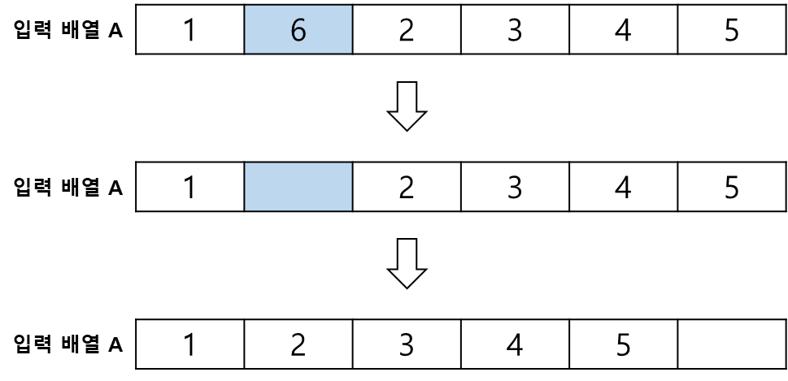

# ArrayList, 순차 리스트

ArrayList 는 배열을 기반으로 하여 논리적인 순서와 물리적인 **순서**대로 메모리에 **연속**하여 저장하는 선형 자료구조이다.
 

배열을 기반으로 하기 때문에 중복을 허용하며 정렬에 사용하기 용이하고, 조회가 편리하다.   
그러나, 연속적인 순서를 보장하고 메모리의 낭비를 줄이기 위해 데이터의 삽입 또는 삭제 시 데이터를 한 칸씩 뒤로 미루어주어야하는 단점이 있다.
   

## 데이터의 삽입
데이터를 맨 뒤에 삽입할 경우 배열의 크기를 증가시키고 데이터를 삽입한다.

    
     
    데이터 삽입(1)

 

데이터를 중간에 삽입할 경우 배열의 크기를 증가시키고 삽입하려는 위치를 기준으로 이후 데이터를 한 칸씩 뒤로 이동시킨 후 데이터를 삽입한다.

    
     
    데이터 삽입(2)

 

## 데이터의 삭제
마지막 데이터를 삭제할 경우 삭제한다.

    
     
    데이터 삽입(1)

중간에 있는 데이터를 삭제할 경우 데이터 삭제 후 삭제된 데이터의 인덱스를 기준으로 이후 데이터를 한 칸씩 앞으로 옮긴다.

    
     
    데이터 삽입(1)

 

삭제된 데이터의 공간은 빈 공간으로 남아있게 된다.
 

## 데이터의 조회 및 수정
데이터의 조회 또는 수정은 인덱스를 참조하여 조회하거나 수정하면 되기에 위 과정처럼 별도의 절차가 필요없다.