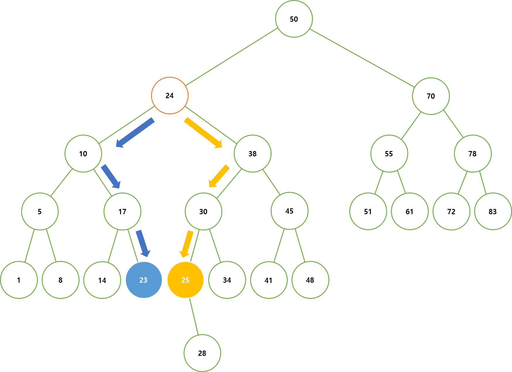

# Binary Search Tree, 이진 탐색 트리

이진 탐색 트리란, 탐색에 특화된 이진 트리를 말한다.   
 

이진 트리의 값이 규칙이 없다면, 특정 값을 찾을 때 최악의 경우에는 모든 노드를 순회해야 할 수도 있다.   
이러한 상황을 방지하기 위해 이진 트리에 조건을 추가한다.   
 

모든 노드는 부모 노드를 기준으로   
왼쪽에 위치한 자식 노드는 부모 노드보다 값이 작아야하고,   
오른쪽에 위치한 자식 노드는 부모 노드보다 값이 커야한다.   
 

이해하기 쉽게 설명하자면,   
자신보다 작은 값을 가진 노드는 왼쪽 자식 노드, 자신보다 큰 값을 가진 노드는 오른쪽 자식 노드로 한다.
 
 

    
     

 
 

이 조건을 모든 노드가 만족하면, 이진 탐색 트리라고 할 수 있다.
 
 

    
     
    이진 탐색 트리

 
 

## 데이터 추가 및 삭제
이진 탐색 트리의 데이터 추가 및 삭제는 일반적인 이진 트리의 추가 및 삭제와 다르다.   
 

데이터를 추가하거나 삭제하여도 항상 이진 탐색 트리의 조건을 만족해야 하기 때문에,   
데이터가 들어갈 위치를 정확하게 찾아 삽입하거나 삭제 시 여러 조건에 따른 분기를 해주어야 한다.   
 

데이터의 추가와 삭제를 그림을 보면서 이해하면 보다 쉬울 것이다.
 
 

### 데이터의 추가

데이터를 추가할 경우는 다음과 같다.   
 

특정 데이터를 추가할 때, 루트의 값부터 차례대로 비교한다.   
 

이진 탐색 트리의 특성에 따라 루트의 값 보다 작으면, 왼쪽 자식 노드의 존재 여부를 판단한다.   
반대로 루트의 값 보다 크면, 오른쪽 자식 노드의 존재 여부를 판단한다.   
 
 

자식 노드가 존재하지 않을 경우, 해당 자리에 데이터를 삽입한다.   
 

자식 노드가 존재할 경우, 해당 자식 노드와 삽입할 데이터를 비교하며면서,   
자식 노드가 존재하지 않을 때까지 이를 반복한다.   
 
 

    
     

 
 
 
 

### 데이터의 삭제

삭제의 경우 크게 3 가지 경우로 나뉜다.
1. 삭제할 노드가 자식 노드를 가지지 않을 경우
2. 삭제할 노드가 하나의 자식 노드만 가질 경우
3. 삭제할 노드가 모든 자식 노드를 가질 경우
 

#### 1. 삭제할 노드가 자식 노드를 가지지 않을 경우

삭제할 노드가 자식 노드를 가지지 않을 경우,   
해당 노드를 삭제해도 이진 탐색 트리의 조건에 영향을 미치지 않는다.
 
 

    
     

 
 

그림에서 볼 수 있듯이, 23의 값을 가진 노드를 삭제해도 이진 탐색 트리의 조건을 만족한다.
 
 

#### 2. 삭제할 노드가 하나의 자식 노드만 가질 경우

삭제할 노드가 하나의 자식 노드만 가질 경우,   
해당 노드를 삭제 후 삭제한 노드의 자식 노드를 삭제한 위치로 옮긴다.
 
 

    
     

 
 

#### 3. 삭제할 노드가 모든 자식 노드를 가질 경우

삭제할 노드가 모든 자식 노드를 가질 경우, 위 방법으로는 해결할 수 없다.
 

1 번 상황의 방법으로 노드를 삭제하게 되면, 삭제할 노드의 아래 노드 모두를 손실하게 된다.   
 
 

    
     

 
 

2 번 상황의 방법으로 해결하려 해도, 어떠한 자식 노드를 옮길 지 몰라 적용할 수도 없다.   
이진 탐색 트리의 특성에 따라 작은 값을 가진 노드를 옮긴다해도, 옮긴 노드가 2개의 자식 노드를 가지면   
삭제할 노드의 부모 노드는 3 개의 자식 노드를 가지게 되므로, 이진 트리의 조건(차수를 2로 제한)을 만족하지 못하게 된다.

    
     

 
 

이렇게 자식 노드를 모두 가지는 상황에서는 이진 탐색 트리의 특성을 활용해서 해결해야한다.   
 

이진 탐색 트리의 조건을 항상 만족하면서 노드를 삭제하려면,   
삭제 노드를 삭제 노드와 가장 가까운 값을 가지는 노드로 대체하는 방법이 가장 이상적이다.   
 

삭제 노드와 가장 가까운 값을 가지는 노드는 다음과 같다.      
- 삭제 노드의 오른쪽 자식 노드 중 제일 작은 값을 가지는 노드(오른쪽 자식 노드 중 가장 왼쪽 노드)
- 삭제 노드의 왼쪽 자식 노드 중 제일 큰 값을 가지는 노드(왼쪽 자식 노드 중 가장 오른쪽 노드)
 

이진 탐색 트리의 특성에 따라 2 가지 방법으로 해당 노드와 가장 가까운 값을 가지는 노드를 찾을 수 있다.
 
 

    
     

 
 

그림에서 볼 수 있듯, 이진 탐색 트리의 특성에 따라   
특정 노드의 왼쪽 자식 중 가장 큰 값을 가지는 노드가 가장 가까운 값을 가지는 노드,   
특정 노드의 오른쪽 자식 노드 중 가장 작은 값을 가지는 노드가 가장 가까운 값을 가지는 노드이다.   
 

이 2 가지 방법 중 하나를 선택하여 삭제할 노드의 대체 노드를 선정한다.   
 

대체할 노드를 선정하였다면, 대체 노드의 부모 간 연결된 링크를 끊고 삭제 노드에 덮어씌운다.
 
 

    
     

 
 

그러나 대체 노드가 자식을 가지고 있을 경우가 있다.   
 

삭제 노드의 왼쪽 자식 노드에서 대체 노드를 선택할 경우,   
대체 노드는 삭제 노드 중 가장 큰 값을 가지는 노드로 대체 노드의 오른쪽 자식 노드는 존재할 수 없다.   
그러나 대체 노드의 왼쪽 자식은 존재할 수 없음을 보장할 수 없다.   
 

반대로 대체 노드를 삭제 노드의 오른쪽 자식 노드에서 선택할 경우,   
대체 노드는 삭제 노드 중 가장 작은 값을 가지는 노드로 대체 노드의 왼쪽 자식 노드는 존재할 수 없다.   
그러나 대체 노드의 오른쪽 자식은 존재할 수 없음을 보장할 수 없다.   
 

그러므로 대체 노드에 자식이 존재할 경우에는,   
대체 노드는 자신의 부모와 링크를 끊고, 삭제 노드에 덮어씌우고,   
대체 노드의 원래 링크를 대체 노드의 자식 노드가 그대로 가져가면 된다.   
 
 

    
     

 
 
 
 

이진 탐색 트리의 데이터 추가 및 삭제 과정은 다른 자료 구조보다는 복잡하다.   
그러나 한 번 이해한다면, 그리 어렵다고 느껴지지는 않을 것이다.