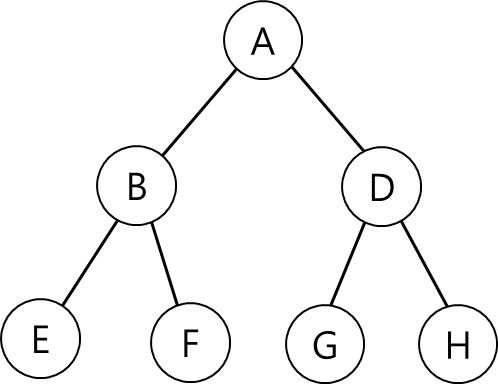
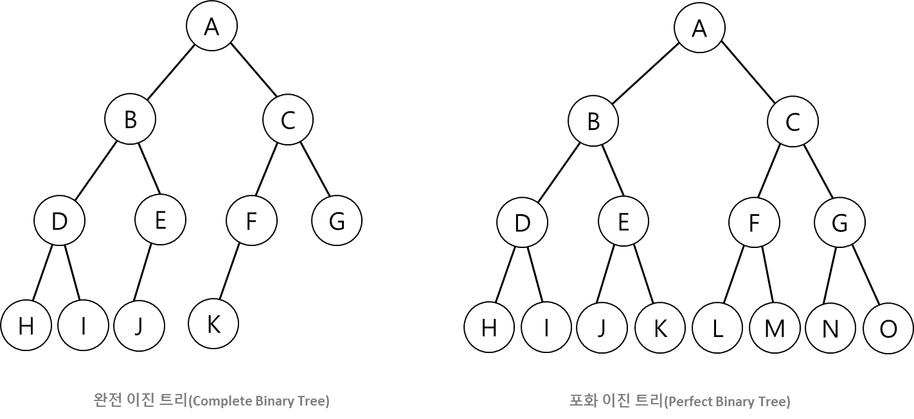

# Binary Tree, 이진 트리

이진 트리는 모든 노드의 차수를 2로 제한한 트리를 말한다.

    
     
    이진 트리

이진 트리는 쉽게 말해서 자식 노드를 최대 2개 까지만 가질 수 있는 트리를 말한다.

 

이진 트리는 특징에 따라 완전 이진 트리, 포화 이진 트리로 구분된다.

    
     

**완전 이진 트리(Complete Binary Tree)**   
이진 트리에서 완전 이진트리를 만족하려면 다음 2 가지 조건을 만족해야 한다.
- 마지막 레벨을 제외한 모든 노드가 존재해야한다.
- 모든 노드는 왼쪽 부터 존재해야한다.
 
 

**포화 이진 트리(Perfect Binary Tree)**
이진 트리에서 포화 이진트리를 만족하려면 이진 트리의 조건을 만족하면서 동시에 다음 조건을 만족해야한다.
- 마지막 레벨을 제외한 모든 노드는 2 개의 자식 노드가 존재해야한다.