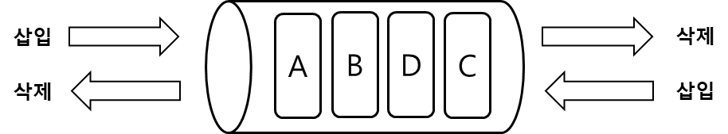

# Deque, 덱

Deque 은 Double-Ended Queue 의 줄임말로, 양쪽으로 데이터의 삽입가 삭제를 수행하는 큐 자료구조를 의미한다.
 

    
     
    덱

 
 

덱은 어떤 방향으로 입력하고 출력하는지에 따라 스택이나 큐로 사용할 수 있다.   
한 방향으로만 삽입하는 덱을 스크롤(Scroll), 한 방향으로만 삭제하는 덱을 셸프(Shelf)라고 한다.
 

덱은 큐를 학습했다면 비교적 쉽게 구현이 가능하며, 배열과 연결리스트로 구현할 수 있다.
 

배열로 덱을 구현할 시 원형 큐 알고리즘을 이용한다.
