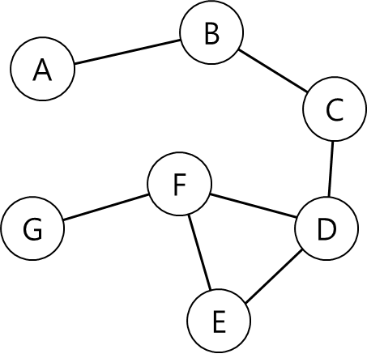
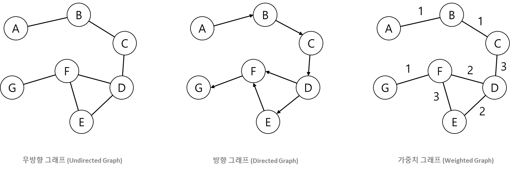

# Graph, 그래프

그래프 는 비선형 자료 구조로 객체 간 관계를 시각적으로 나타낼 수 있는 구조를 나타낸다.

    
     
    그래프

 

그래프는 정점과 간선으로 이루어져있다.   
정점과 간선은 다음과 같다.
- **정점**: 각 그림에서 보이는 객체를 의미
  - A, B, C, D, E, F, G, H
- **간선**: 정점을 연결하는 선
  - 수학적으로 G = (V, E)로 표현한다.

 

그래프는 특징에 따라 여러 가지 용어로 표현한다.
- **인접 정점**: 간선에 의해 직접 연결된 정점
  - B의 인접 정점은 A, C
- **정점의 차수**: 정점에 연결된 간선의 수
  - H의 정점의 차수는 3
- **경로**: 간선을 따라 갈 수 있는 길
  - A에서 D로 갈 수 있는 경로는 다음과 같다.
  - A > B > C > D
- **경로의 길이**: 경로를 구성하는데 사용된 간선의 수
  - 위 경로의 길이는 4
- **단순 경로와 사이클**: 경로 중에서 반복되는 간선이 없는 경로
- **연결 그래프**: 모든 정점들 사이에 경로가 존재하면 연결 그래프
- **트리**: 사이클을 가지지 않는 연결 그래프
- **완전 그래프**: 모든 정점 간에 간선이 존재하는 그래프

그래프는 다음과 같이 세 가지 종류가 있다.

    
     

 

**무방향 그래프 (Undirected Graph)**   
간선의 방향이 없는 그래프를 말한다.   
이는 간선의 방향이 양방향임을 의미하며, 간선 (A, B)와 간선 (B, A)는 같은 간선이 된다.
 

**방향 그래프 (Directed Graph)**   
간선에 방향이 존재하는 그래프를 말한다.
이는 간선의 방향이 단방향임을 의미한다.
 

**가중치 그래프 (Weighted Graph)**   
간선의 비용이나 가중치가 할당된 그래프를 말한다.
가중치는 양수 또는 음수를 가질 수 있으며, 주로 최단 경로 문제를 해결하는 데 사용하게 된다.