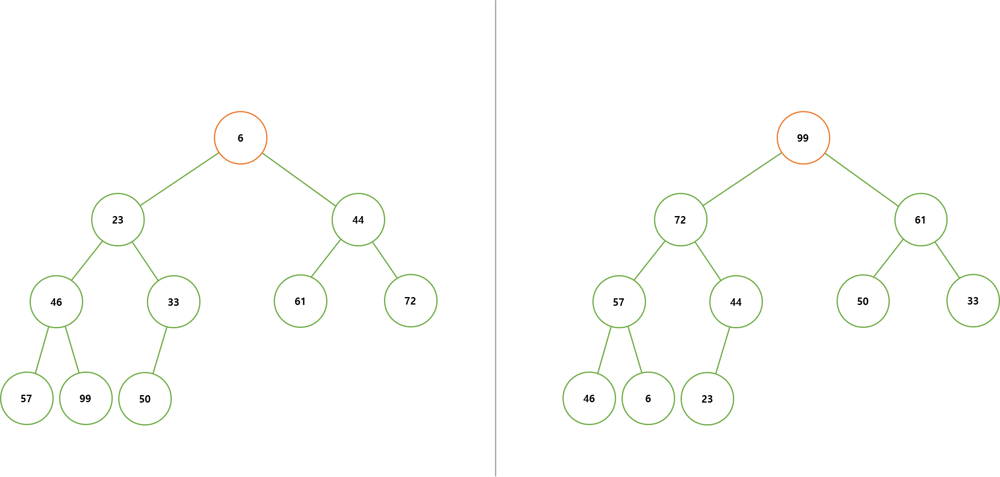
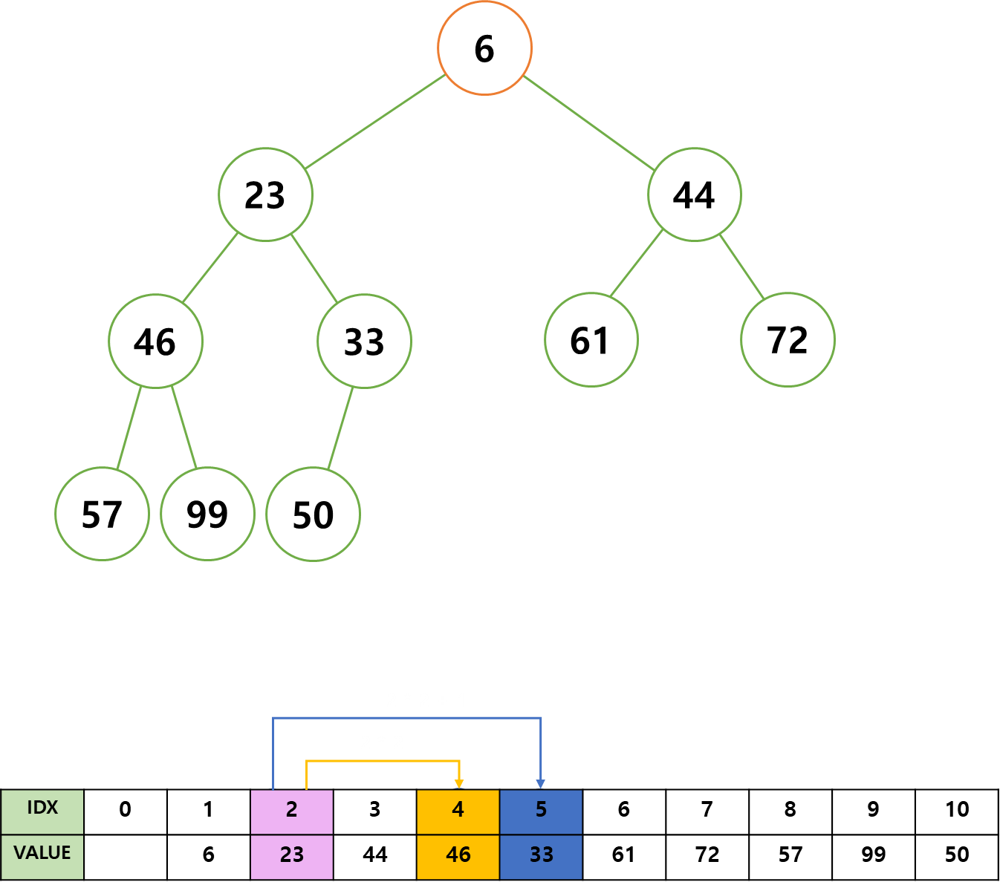
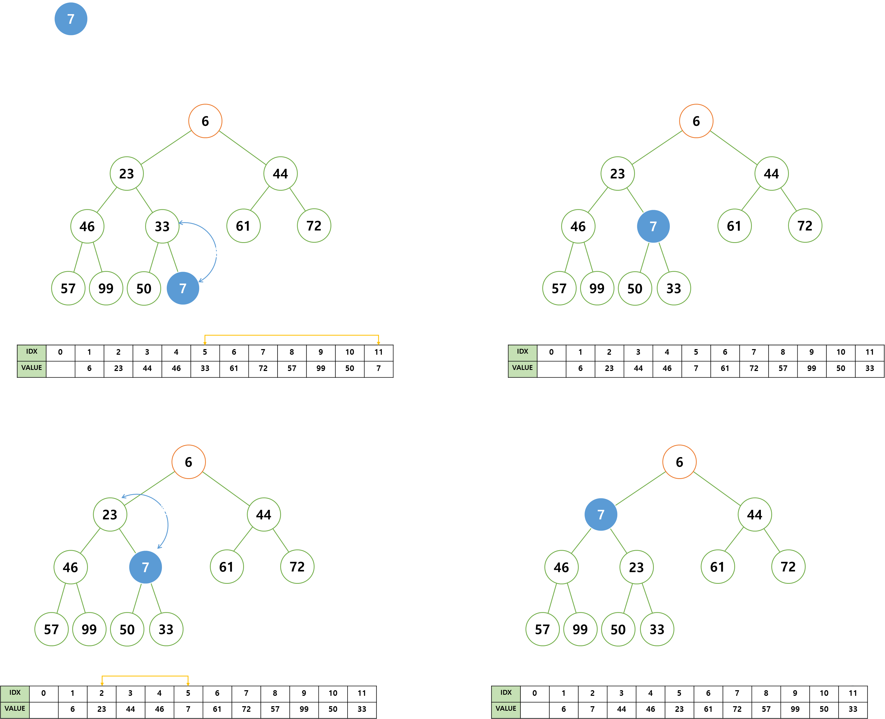
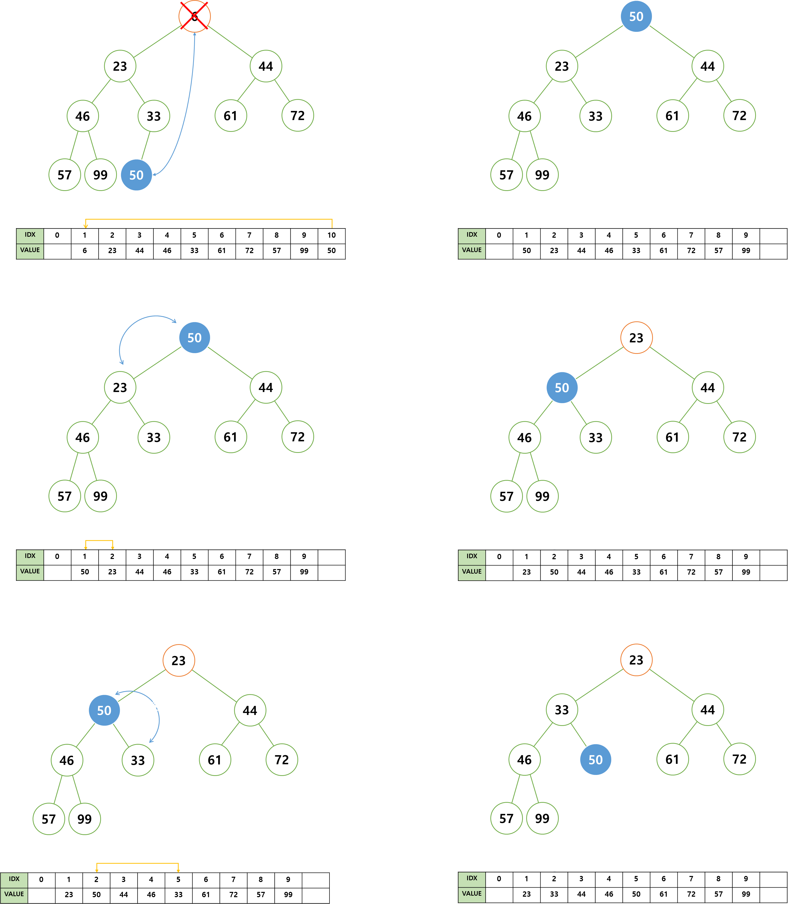

# Heap, 힙

힙이란, 최소 또는 최대 값을 빠르게 찾기 위해 완전 이진 트리로 구현된 자료구조를 말한다.   
 

힙은 최소 힙, 최대 힙으로 두 종류가 있다.   
 
 

    
     

 
 

리스트로 충분히 대체 가능한 것 같은데, 힙 자료구조를 왜 사용할까?   
 

리스트에서 최대 또는 최소 값을 찾기 위한 방법으로 리스트의 모든 원소 비교하는 방법이 있다.   
이 방법은 최대 또는 최소 값이 필요할 때마다 모든 원소를 비교해야하기 때문에 너무 비효율적이다.   
 

다음으로 리스트의 각 원소를 정렬하여 최대 또는 최소 값을 찾아내는 방법을 사용할 수 있다.   
그러나 새로운 데이터가 들어올 때마다 정렬을 수행해야 한다.   
 

그렇다면 어떻게 정렬을 효율적으로 할 수 있을까?   
이를 위해 **우선 순위**라는 조건이 추가된 **완전 이진 트리**를 이용한다.   

우선 **우선 순위** 조건에 대해서 알아보자.   
#### 부모 노드는 자식 노드보다 항상 우선 순위가 높다.   

이는 곧 루트 노드가 우선 순위가 제일 높다는 것을 의미하기도 한다.   
그렇다면 최대 또는 최소 값을 찾을 때, 루트 노드만 확인하면 되는 것이다.   
 
 
그러면 새로운 데이터가 추가되었을 때의 정렬이 효율적인 이유는 뭘까?   
 

완전 이진 트리의 마지막 레벨에 추가된 데이터는 우선 순위가 높은 부모 노드와 비교하여 정렬을 수행하게 되면,  
즉, 트리의 깊이만큼 비교하면 되기에, 비교할 노드가 리스트에 비해 상대적으로 많이 적어진다.   
 

힙은 배열과 연결 리스트로 구현할 수 있다.   
 

연결 리스트로 구현 시 검색과 이동에 번거로움이 있는 반면,   
배열로 구현 시 인덱스에서 오는 장점이 명확하기에 배열로 구현할 것이다.   
 

힙을 시작 인덱스를 1로 하여 배열을 사용해 구현하게 되면, 3 가지 변하지않는 규칙이 발생한다.
- 왼쪽 자식 노드 인덱스 = 부모 노드 인덱스 * 2
- 오른쪽 자식 노드 인덱스 = 부모 노드 인덱스 * 2 + 1
- 부모 노드 인덱스 = 자식 노드 인덱스 / 2
 
 

    
     

 
 

이 규칙을 이용하여 인덱스를 보다 쉽게 찾을 수 있다.
 
 

데이터의 추가 및 삭제는 최소 힙으로 설명할 것이다.   
최소 힙과 최대 힙의 차이는 대소 관계 비교만 반대일 뿐, 알고리즘은 동일하다.
 
 

### 데이터의 추가
새롭게 추가된 데이터를 부모 노드와 비교하여 부모 노드보다 작으면 데이터를 교환하여 트리를 조건에 부합하게 한다.   
이 과정을 추가된 데이터가 부모 노드보다 클 때 까지 반복한다.   
 
 

    
     

 
 

이처럼 아래부터 위로 올라가면서 재배치하는 과정을 상향 선별이라고 한다.
 
 

### 데이터의 삭제
삭제는 추가와 반대로 진행된다.   
 

루트 노드를 삭제하고 우선 순위가 가장 낮은 노드를 루트 노드에 배치한다.   
루트 노드부터 자식 노드 중 더 작은 값과 교환하면서, 자식 노드가 더 크거나 자식 노드가 없을 때 까지 반복한다.   
 
 

    
     

 
 
 
 
