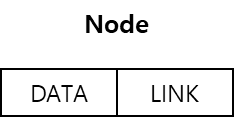
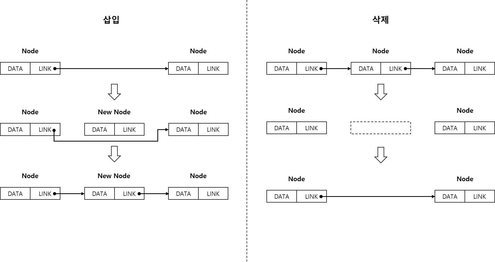
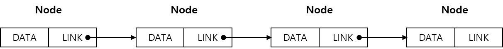
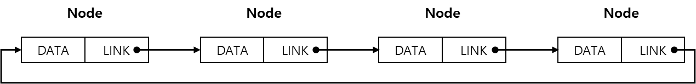
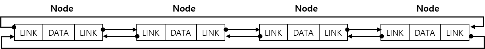

# LinkedList, 연결 리스트

LinkedList 는 각 원소가 원소의 주소에 대한 참조를 통해 연결되는 형태의 선형 리스트이다.
 

선형 리스트는 논리적인 순서와 물리적인 순서가 일치하여 검색에 용이하지만,   
삽입 또는 삭제 시 이 순서를 유지하기 위해 원소를 이동시켜야하는 별도의 작업이 필요하다.
 
이를 해결하기 위해 고안된 방식이 연결 리스트이다.

연결 리스트는 데이터와 다음 원소의 주소를 참조하는 링크를 가지는 노드라는 단위를 사용한다.

    
     
    노드

 
 

데이터의 삽입 또는 삭제 시 링크만을 수정하기에 순차 리스트의 원소를 이동시키는 작업에서 오는 부담을 줄일 수 있다.

    
     
    노드의 삽입 및 삭제

   

## 연결 리스트의 종류
연결 리스트는 3 가지로 구분된다.
 

- 단순 연결 리스트   
노드가 하나의 링크에 의해 다음 노드와 연결되는 구조를 갖는 연결 리스트이다.

    
     
    단순 연결 리스트

 
 

- 원형 연결 리스트   
리스트의 마지막 노드가 다음 노드의 주소로 첫 번째 노드를 참조하여 원형 구조의 형태를 가지는 리스트이다.

    
     
    원형 연결 리스트

 
 

단순 연결 리스트의 이전 노드를 참조할 수 없다는 단점을 보완한다.
 
 

- 이중 연결 리스트   
이전 노드와 다음 노드의 주소, 즉 노드를 양쪽 방향으로 참조할 수 있도록 구성하는 연결 리스트이다.

    
     
    이중 연결 리스트

 
 

원형 연결리스트의 이전 노드를 참조하려면 리스트 전체를 한 바퀴 순회해야만 하는 문제점을 보완한다.

 
