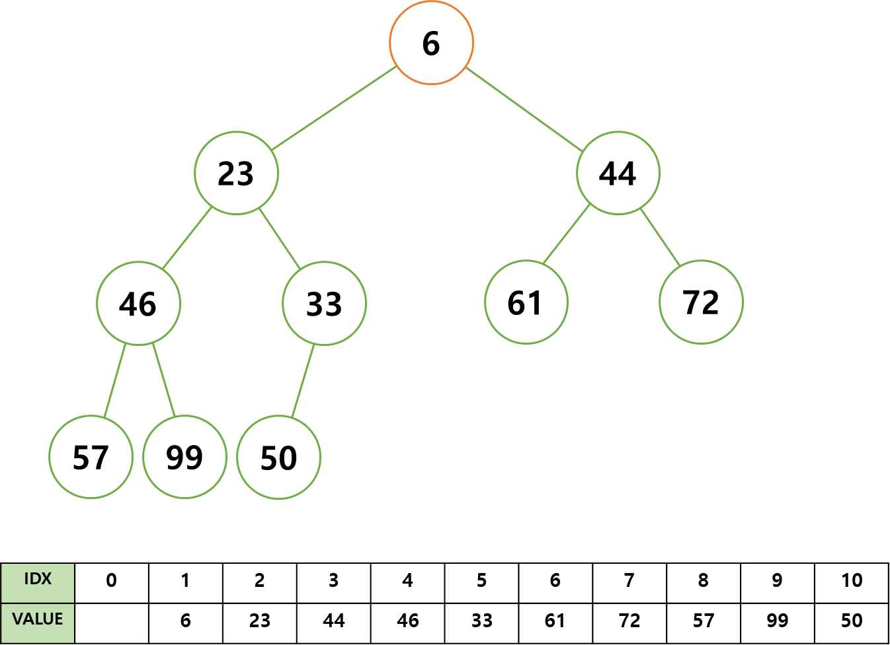

# Priority Queue, 우선순위 큐

> 우선 순위 큐를 학습하기 전 큐(Queue)와 힙(Heap) 자료 구조에 대한 이해가 필요하다.   
> 다음 링크를 참고하고 학습하길 바란다.   
> - <a href="" style="font-weight: bold;">Queue, 큐</a>   
> - <a href="" style="font-weight: bold;">Heap, 힙</a>

 
 

**우선 순위 큐**란 우선 순위가 높은 요소 우선 순위가 낮은 요소 보다 먼저 제공되는 큐 자료구조다.   
 

우선 순위 큐는 리스트 또는 연결 리스트, 힙으로 구현이 가능하다.   
보통 힙으로 우선 순위 큐를 구현하는 데 이유를 알아보자.
 

리스트 또는 연결 리스트를 이용하여 우선 순위 큐를 구현 시,   
데이터를 삽입할 때의 시간 복잡도는 **O(1)**, 삭제할 때는 **O(n)** 이 된다.
 

힙으로 구현 시 힙 자료 구조에 대한 이해가 필요하지만,   
데이터를 삽입할 때의 시간 복잡도는 **O(log₂n)**, 삭제할 때는 **O(log₂n)** 이 된다.   
 

우선 순위 큐에 데이터가 많이 적재되었을 때,   
리스트 또는 연결 리스트로 이를 구현했다면 삽입에는 영향이 없으나,   
최악의 경우에 삭제 시 상당한 시간이 소요될 것이다.   
 

그러나 힙으로 구현했다면, 데이터가 많아질수록 리스트 또는 연결 리스트로 구현했을 때 보다 적은 시간이 소요된다.
 

우선 순위 큐를 힙으로 구현하는 가장 큰 이유는 효율성이다.   
리스트 또는 연결 리스트로 구현했을 때 보다 힙으로 구현했을 때의 효율성이 월등히 뛰어나기 떄문이다.
 

코드를 구현하다 보면, 힙 자료 구조의 코드와 다를게 없어 보이지만   
힙을 이용하여 구현하였을 뿐, 우선 순위 큐와 힙은 엄연히 다른 개념이다.
 
 

    
     

 
 

그림과 같이 배열로 구현된 최소 힙이 있을 때, 힙은 형제 노드 간 우선 순위를 매기지 않는다.   
그러므로 힙을 출력하면 다음과 같이 출력하게 된다.
**[6, 23, 44, 46, 33, 61, 72, 57, 99, 50]**   
 

그러나 우선 순위 큐의 알고리즘대로 데이터를 출력하게 되면 데이터는 다음과 같이 출력된다.   
**[6, 23, 33, 44, 46, 50, 57, 61, 72, 99]**

힙과 우선 순위 큐의 차이가 보이는가?   
힙은 최대 또는 최소 값에 중점을 두어 형제 노드 간 우선 순위는 무시하기 때문에 위와 같이 출력하지만,       
우선 순위 큐는 우선 순위가 높은 것 부터 데이터를 제공해야하기 때문에 정렬된 모습으로 출력하게 되는 것이다.
 
 
 
 