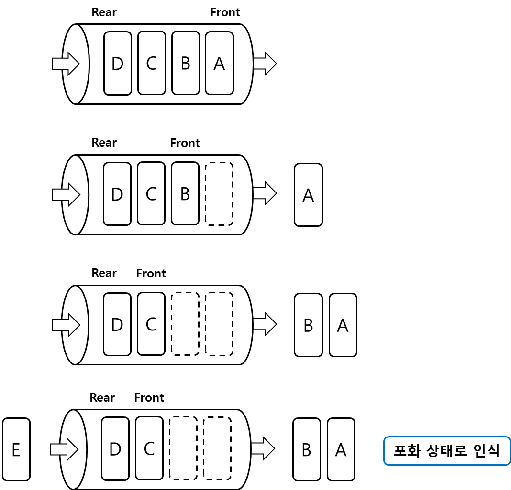

# Queue, 큐

**Queue** 는 **선입선출** 특성을 가지는 선형 자료구조이다.
 

선입선출(First In First Out, FIFO)이란 가장 먼저 들어온 것이 가장 먼저 나간다는 뜻으로,   
큐는 가장 먼저 들어온 자료가 가장 먼저 나가는 구조의 형태로 구현된다.
 

    
     
    큐

 

큐는 배열과 연결 리스트로 구현이 가능하다.
 

배열로 큐를 구현하다보면 원소를 삭제 시 원소를 재배치해야하는 번거로움이 생긴다.   
원소를 재배치하지 않으면, 데이터가 없음에도 큐를 포화 상태로 인식하여 삽입 연산을 수행하지 않는다.   
 

    
     
    큐의 원소를 재배치하지 않고 삽입하는 경우

 

이러한 큐를 **선형 큐**라고 하며, 선형 큐의 문제를 해결하기 위해 재배치를 수행하게 되면 오버헤드가 발생한다. 
 

선형 큐의 재배치에서 발생하는 오버헤드를 해결하기위해 **원형 큐** 방식을 사용한다.   
 

**원형 큐**란 배열의 처음과 끝을 논리적으로 연결되어있다고 간주한 큐이다.
 

    
     
    원형 큐

 

배열의 처음과 끝이 연결되어있다고 간주하여, 재배치 과정이 필요없어지게 된다.   
그러나 선형 큐와는 다르게 포화 상태 또는 공백 상태를 쉽게 다루기 위해, front 를 비워둔다.