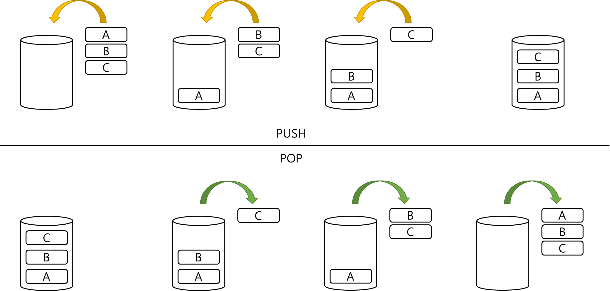

## Stack, 스택

**Stack** 은 **후입선출** 특성을 가지는 선형 자료구조이다.

**후입선출(Last In First Out, LIFO)** 이란 나중에 들어온 것이 먼저 나간다는 뜻으로,   
스택은 가장 나중에 들어온 자료가 가장 먼저 나가는 형태로 구현된다.
 

스택에서는 데이터의 삽입을 **push**, 삭제를 **pop**, 조회를 **peek** 이라고 표현한다.
 

    

 
 

스택은 **배열**과 **연결 리스트**로 구현할 수 있다.
