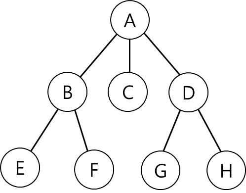

# Tree, 트리

Tree 는 그래프를 기반으로 계층이 추가한 형태를 보이는 비선형 자료 구조이다. 

    
     
    트리

 

트리는 여러 노드가 서로 연결된 형태로 구성되어 있으며, 각 노드는 서로 부모와 자식간의 관계를 가진다.

트리의 각 노드는 특징에 따라 다음과 같은 여러 용어로 표현한다.

- **Root**: 트리 구조의 최상단 노드
  - A 노드
- **Leaf**: 자식 노드를 갖지 않는 모든 노드
  - C, E, F, G, H
- **Level**: 노드의 계층
  - A 노드는 1 Level, B C D 노드는 2 Level ...
- **Parent**: 자식 노드를 가지는 모든 노드
  - A, B, D
- **Child**: 부모 노드를 가지는 모든 노드
  - B, C, D, E, F, G, H
- **Sibling**: 동일한 부모 노드를 가지며, 같은 레벨에 위치한 노드
  - B, C, D
  - E, F
  - G, H
- **Edge**: 노드를 연결하는 선
- **Depth**: 특정 노드에서 루트 노드까지의 길이
  - E, F의 Depth 는 2
- **Height**: 트리에서 가장 긴 경로의 길이
  - A > B > E , A > B > F, A > D > G, A > D > H
  - 위 가장 긴 경로의 길이는 모두 2로 Height 는 2
- **Sub Tree**: 전체 트리에 존재하는 부분적인 트리
 

